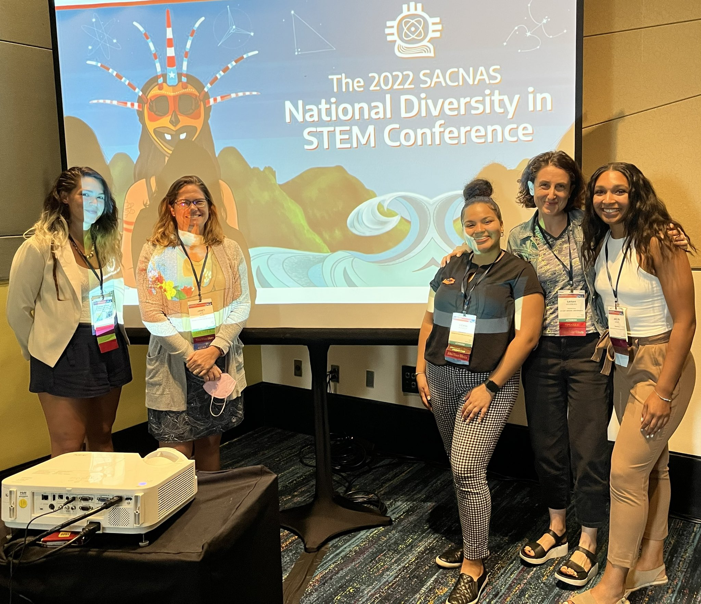

## Fisheries Ecology and Climate Change Session at SACNAS2022
Presentations by the Nye Quantitative Fisheries Ecology Lab at the 2022 SACNAS National Diversity in STEM Conference. Learn more at https://nye.unc.edu/

10/29/2022

Session Introduction: Dr. Janet Nye, Associate Professor Institute of Marine Science at UNC Chapel Hill 

"Climate change impacts on fish physiology and fisheries ecology" by Adelle Molina, PhD and Postdoctoral Scholar at Rutgers University 

"Climate change in coastal oceans" by Ileana Fenwick, PhD Student at UNC Chapel Hill 

"Assessing the long term impact of 2013 morbillivirus associated with mass stranding event on Common Bottlenose Dolphins from Virginia, USA" by Jaelyn Leslie, M.Sc and Laboratory Technician for the Institute of Marine Sciences at UNC Chapel Hill 

"Which Fish? DNA Barcoding enables broad participation in understanding species dynamics in a warming ocean" by Sarah Weisberg, PhD Candidate at Stonybrook University

# Resources 
We wanted to share some additional resources that may serve helpful as you navigate the field of marine science. Coming soon! 

# Cool Papers 
Interested in diving into climate change and fisheries further? Check out some of our favorite papers. 

Free, C. M., Thorson, J. T., Pinsky, M. L., Oken, K. L., Wiedenmann, J., & Jensen, O. P. (2019). Impacts of historical warming on marine fisheries production. Science, 363(6430), 979-983.

